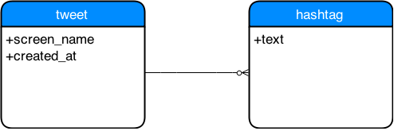

## Assignment 3


### Introduction
The analysis tasks for this assignment included answering the following questions:
 1. Who tweeted the most during the conference?
 1. What were the top 10 hash tags used?
 1. For a particular hour, how many tweets were produced?

### Task 1
To perform this analysis a simple entity relationship was selected:



The strength of this entity relationship is its simplicity.  The raw data collected from 
Twitter API contains a wealth of information, not all of it useful to our analysis goals. In 
order to perform the assigned analyses it was decided to use a very simple, concise, model
of a "tweet" utilizing only the required entities, attributes and relationships.  There are
some tradeoffs due this simplification and these will be discussed below.

For each tweet the `screen_name` of the tweeting user (`user.screen_name` in the twitter 
API response) was extracted along with the `created_at` timestamp of the tweet.  As a
tweet can have `[0..*]` hashtags, a separate entity for was created with the cardinality 
relationship noted.

There is some risk is simply using the `screen_name` to capture the concept of a "user". Users
can modify their twitter `screen_names`.  This behavior can be tracked by capturing 
the twitter API reponses `user.id` and utilizing a `user.id [1..*] screen_name`
relationship.  Additionally, individual persons my utilize one or more twitter accounts. A 
example of this is the twitter account with the screen name `xmlprague`.  As this is
likely an organizational account it's possible it's accessed by one or more users, each with their
own individual twitter accounts.  Given the short data acquisition period, the low likelyhood of
users modifying their `screen_name` within this period, the complexity introduced by attempting
to track this relationship (ingest and analysis) and the inherent difficulty in tracking an individual
person's use of a given twitter account it as decided that the _"Who"_ in _"Who tweeted the most during
the conference?"_ should be represented with the twitter API response's `user.screen_name`.

### Task 2
#### Key/Value
##### Data Model
For a Key/Value store it's advantageous to represent the data in a tablular format stored delimited text
files.  This facilitates the use of various map/reduce technologies which are geared towards operating
with delimited text files.  My model would consist of storing each tweet as a `\n` delimited record with
individual record attributes delimited with `,`.  This data model is easily implemented as there is only a
single attribute, a tweet's hashtags, that may contain a dynamic number of values.  This can be facilitated
by placing this attribute last.  

Each tweet record will contain the following fields encoded with UTF-8 in order:
 1. `created_at`
    1. As an ISO 8601 DateTime entry in UTC due to the ubiquitous support parsing of its format
 1. `user.screen_name`
 1. `enitities.hashtags.text`
    1. May be represented with 0 or more values

As an example the first two tweets in the file `prague-2015-02-14.json` would result in the following records
```
2015-02-14T23:22:26Z,avernet,xmlprague,marklogic,orbeon
2015-02-14T23:06:47Z,xquery,xmlprague,xmlprague
```
Tweets could then be serialized into partitioned files. An obvious scheme would be to partition the files by hour as this plays well with one of the required analyses without impacting the others.

##### Storage Process
The tabular format model was implemented by traversing the twitter API responses by deserializing the JSON and emitting the required fields into partitioned text files.  The only transformation of note would be the conversion of the twitter API reponse's `created_at` date encoding to ISO 8601.
```python
def transform_data():
    with open('mrjob.txt', 'wb') as writer:
        for tweet in prague_tweets.tweets():
            record = [
                prague_tweets.string_to_datetime(tweet[u'created_at']).isoformat() + 'Z',
                tweet[u'user'][u'screen_name'],
            ]
            record += [hashtag[u'text'] for hashtag in tweet[u'entities'][u'hashtags']]
            writer.write(','.join(record) + '\n')
```
Complete implementation available here:
 * [prague_tweets.py](https://github.com/tkunicki/w205-assignments/blob/assignment3/assignment3/prague_tweets.py)
 * [mrjob_data.py](https://github.com/tkunicki/w205-assignments/blob/assignment3/assignment3/mrjob_data.py)

_Note:  Given the limited number of input records I deferred paritioning the text files in this implementation_

##### Analysis Procedures
###### Who tweeted the most during the conference?
This analysis was implemented using map/reduce. The mapper emits a tuple with a key containing the record `screen_name` and a value of `1`.  The reducer then aggregates the counts for each key.  The output of the reducer could then be merged and sorted according to the magnitude of the value and the top or last entry reported base on the sort order selected.  Alternatively the map/reduce job output stream could be analyzed to pick off the maximum observed key/value pair.
```python
class TweetCountJob(MRJob):

    def mapper(self, _, line):
        yield line.split(',')[1], 1

    def combiner(self, word, counts):
        yield word, sum(counts)

    def reducer(self, word, counts):
        yield word, sum(counts)
```
Complete implementation available here:
 * [mrjob_tweet_count.py](https://github.com/tkunicki/w205-assignments/blob/assignment3/assignment3/mrjob_tweet_count.py)
 * [mrjob_tweet_max.py](https://github.com/tkunicki/w205-assignments/blob/assignment3/assignment3/mrjob_tweet_max.py)

###### What were the top 10 hash tags used?
This analysis was also implemented using map/reduce. The mapper emits a tuple with a key containing the records `hastag` entries and a value of `1`.  The reducer then aggregates the counts for each key.  The output of the reducer would then need to be merged and sorted according to the magnitude of the value and the top or last 10 entries reported base on the sort order selected.  Alternatively the Map/Reduce job output stream could be processed using a min heap keyed on count with the pair with the smallest value dropped when the size of the heap is greater than 10.  The heap at the end of the stream contains the 10 largest values.
```python
class HashtagCountJob(MRJob):

    def mapper(self, _, line):
        for item in line.split(',')[2:]:
            yield item.lower(), 1

    def combiner(self, word, counts):
        yield word, sum(counts)

    def reducer(self, word, counts):
        yield word, sum(counts)
```
Complete implementation available here:
 * [mrjob_hastag_count.py](https://github.com/tkunicki/w205-assignments/blob/assignment3/assignment3/mrjob_hashtag_count.py)
 * [mrjob_hashtag_top10.py](https://github.com/tkunicki/w205-assignments/blob/assignment3/assignment3/mrjob_hashtag_top10.py)

###### For a particular hour, how many tweets were produced?
This analysis was implemented using map/reduce. The mapper emits a tuple with a key containing the record's `created_at` entry with the hour transformed to CET and a value of `1`.  The reducer then aggregates the counts for each key.  The output of the reducer would then need to be merged and sorted according to the hours of interest selected and output.  Alternatively the map/reduce job could be run only on the partitions of interest, if partitioning by hour was used.
```python
class HourCETCountJob(MRJob):

    def mapper(self, _, line):
        hour_cet = (dateutil.parser.parse(line.split(',')[0]).hour + 1) % 24
        yield "%02d:00+0100" % hour_cet, 1

    def combiner(self, word, counts):
        yield word, sum(counts)

    def reducer(self, word, counts):
        yield word, sum(counts)
```
Complete implementation available here:
 * [mrjob_hour_cet_count.py](https://github.com/tkunicki/w205-assignments/blob/assignment3/assignment3/mrjob_hour_cet_count.py)
 * [mrjob_hour_cet_count_09_16.py](https://github.com/tkunicki/w205-assignments/blob/assignment3/assignment3/mrjob_hour_cet_count_09_16.py)

_Note:  Given the limited number of input records I deferred paritioning and/or filtering the input by hour in this implementation_

#### NoSQL
##### Data Model
As I decided to investigate MongoDB for this portion of the assignment I chose to model the tweets in a single collection with each tweet and its associated hastags as a single document.  An example of the data model is presented with the first tweet in the `prague-2015-02-14.json`.
```json
{
  "screen_name": "avernet",
  "created_at": new Date("2015-02-14T17:22:26-0600"),
  "hashtags": [
    "xmlprague",
    "marklogic",
    "orbeon"
  ]
}
```

##### Storage Process
The tweets were stored by parsing each tweet in the input and deserializing the JSON.  Instead of parsing each file as an array, individual lines were parsed and each object presented to a transformation method using python iterators.  This method was selected as a practice in scalability.  The deserialized JSON objects where transformed by wrapping the iterator and presenting a transformation iterator to the MongoDB driver in a single bulk loading call.
```python
tweet_url_base =\
    "https://raw.githubusercontent.com/alexmilowski/data-science/master/assignments/organizing-tweets/"

tweet_files = [
    "prague-2015-02-14.json",
    "prague-2015-02-15.json"
]


def acquire(tweet_file):
    if not os.path.isfile(tweet_file):
        url = tweet_url_base + tweet_file
        print "file '%s' is missing, downloading from %s" % (tweet_file, url)
        with contextlib.closing(urllib2.urlopen(url)) as tweet_reader, open(tweet_file, 'wb') as tweet_writer:
            tweet_writer.write(tweet_reader.read())


def tweets():
    for tweet_file in tweet_files:
        acquire(tweet_file)
        print "reading '%s'" % tweet_file
        with open(tweet_file, 'r') as tweet_reader:
            for line in tweet_reader:
                if len(line) > 2:
                    if line[-2] == ',':
                        line = line[:-2]
                    else:
                        line = line[:-1]
                    yield json.loads(line)
                
def load_data(tweet_collection):
    tweet_collection.insert(transform_json(prague_tweets.tweets()))
```
Complete implementation available here:
 * [prague_tweets.py](https://github.com/tkunicki/w205-assignments/blob/assignment3/assignment3/prague_tweets.py)
 * [mongo_analysis.py](https://github.com/tkunicki/w205-assignments/blob/assignment3/assignment3/mongo_analysis.py)

##### Analysis Procedures
###### Who tweeted the most during the conference?
This analysis was performed using MongoDB's map/reduce engine in a manner consistent with the Key/Value description.  Sorting was performed using the MongoDB driver (descding order) and the result set limited to a single document.
```python
mongo_screenname_mapper = """
    function () {
        emit(this.screen_name, 1)
    }
"""

mongo_count_reducer = """
    function (key, values) {
        var total = 0;
        for (var i = 0; i < values.length; i++) {
            total += values[i];
        }
        return total;
    }
"""

count_reducer = bson.code.Code(mongo_count_reducer)

def count_tweets(tweet_collection, limit=1):
    screenname_mapper = bson.code.Code(mongo_screenname_mapper)
    counts = tweet_collection.map_reduce(screenname_mapper, count_reducer, "tweet_counts")\
        .find().sort(u'value', -1).limit(limit)
    return map(lambda count: (count[u'_id'], int(count[u'value'])), counts)
```
Complete implementation available here:
 * [mongo_analysis.py](https://github.com/tkunicki/w205-assignments/blob/assignment3/assignment3/mongo_analysis.py)

###### What were the top 10 hash tags used?
This analysis was performed using MongoDB's map/reduce engine in a manner consistent with the Key/Value description.  Sorting was performed using the MongoDB driver (descending order) and the result set limited to 10 documents.
```python
mongo_hashtag_mapper = """
    function () {
        this.hashtags.forEach(function(hashtag) {
            emit(hashtag.toLowerCase(), 1);
        });
    }
"""

mongo_count_reducer = """
    function (key, values) {
        var total = 0;
        for (var i = 0; i < values.length; i++) {
            total += values[i];
        }
        return total;
    }
"""

count_reducer = bson.code.Code(mongo_count_reducer)

def count_hashtags(tweet_collection, limit=10):
    hashtag_mapper = bson.code.Code(mongo_hashtag_mapper)
    counts = tweet_collection.map_reduce(hashtag_mapper, count_reducer, "hastag_counts") \
        .find().sort(u'value', -1).limit(limit)
    return map(lambda count: (count[u'_id'], int(count[u'value'])), counts)
```
Complete implementation available here:
 * [mongo_analysis.py](https://github.com/tkunicki/w205-assignments/blob/assignment3/assignment3/mongo_analysis.py)

###### For a particular hour, how many tweets were produced?
This analysis was performed using MongoDB's map/reduce engine in a manner consistent with the Key/Value description.  Conversion from hour UTC to CET is performed in the mapper. Alternately I could have used MongoDB's aggregation pipeline which has better support for decomposing a timestamp into components. The initial query passed to the map/reduce call didn't filter by the hours of interest due to the complexity of performing this with a mongo query (community consensus seems to state if these timestamp-component queries are desired that the timestamp should be decomposed when the document is inserted).  The query for the hour of interest was performed on the result of the map/reduce operation.
```python
mongo_hour_mapper = """
    function () {
        var date = new Date(this.created_at)
        var hour_cet = (date.getUTCHours() + 1) % 24
        emit(hour_cet, 1)
    }
"""

mongo_count_reducer = """
    function (key, values) {
        var total = 0;
        for (var i = 0; i < values.length; i++) {
            total += values[i];
        }
        return total;
    }
"""

count_reducer = bson.code.Code(mongo_count_reducer)

def count_hours(tweet_collection, start_hour_cet=0, end_hour_cet=24):
    query = {'$and': [{'_id': {'$gte': start_hour_cet}}, {'_id': {'$lte': end_hour_cet}}]}
    hours_mapper = bson.code.Code(mongo_hour_mapper)
    counts = tweet_collection.map_reduce(hours_mapper, count_reducer, "hour_counts")\
        .find(query).sort(u'_id', 1)
    return map(lambda count: ("%02d:00+0100" % count[u'_id'], int(count[u'value'])), counts)
```
Complete implementation available here:
 * [mongo_analysis.py](https://github.com/tkunicki/w205-assignments/blob/assignment3/assignment3/mongo_analysis.py)

#### Relational
##### Data Model
For the relational data mode I chose to create two tables.  One for `tweets` and one for associated `hashtags`.  Primary keys (`id`) were generated for both tables along with uniqueness constraints.  In addition a foreign key was generated in the `hashtags` table to relate records back to their `tweets` entry (this was not used).  Given that I was using SQLite3 dates were stored as text with ISO 8601 formatting to take advantage of datetime operations.  No indices were created as, given the nature of the queries and the size of the input data, there appeared to be marginal benefit.  _The SQL data model design and insertion process was a strong influence on my simplified entity relationship. I wanted to avoid a lot of work_
```sql
CREATE TABLE tweets (
    id INTEGER NOT NULL UNIQUE,
    screen_name TEXT NOT NULL,
    created_at TEXT NOT NULL,
    PRIMARY KEY(id)
);
CREATE TABLE hashtags (
    id INTEGER NOT NULL UNIQUE,
    tweet_id INTEGER NOT NULL,
    hashtag TEXT NOT NULL,
    PRIMARY KEY(id)
);
```

##### Storage Process
Tweets were read in using the same streaming iterator pipeline used in the NoSQL implementation.  Tweet and hashtag id's were manually tracked (the SQLite3 documentation stated autoincrement use was expensive).  The fields from the deserialized JSON were extracted and ingested into the database using SQL `INSERT` calls.
```sql
INSERT INTO tweets (id, created_at, screen_name) VALUES(?, ?, ?)
```
```sql
INSERT INTO hashtags (id, tweet_id, hashtag) VALUES(?, ?, ?);
```
```python
def create_schema(tweet_connection):
    tweet_connection.execute(sqlite3_tweets_create)
    tweet_connection.execute(sqlite3_hashtags_create)


def load_data(tweet_connection):
    tweet_id = 0
    hashtag_id = 0
    for tweet in prague_tweets.tweets():
        created_at = prague_tweets.string_to_datetime(tweet[u'created_at']).isoformat() + "Z"
        screen_name = tweet[u'user'][u'screen_name']
        tweet_connection.execute(sqllite3_tweets_insert, (tweet_id, created_at, screen_name))
        for entity in tweet[u'entities'][u'hashtags']:
            tweet_connection.execute(sqllite3_hashtags_insert, (hashtag_id, tweet_id, entity[u'text']))
            hashtag_id += 1
        tweet_id += 1
    tweet_connection.commit()
```
Complete implementation available here:
 * [sqlite_analysis.py](https://github.com/tkunicki/w205-assignments/blob/assignment3/assignment3/sqlite_analysis.py)

##### Analysis Procedures
###### Who tweeted the most during the conference?
This query was performed with SQL.
```sql
SELECT screen_name, COUNT(*) FROM tweets GROUP BY screen_name ORDER BY COUNT(*) DESC LIMIT %d;
```
###### What were the top 10 hash tags used?
This query was performed with SQL.
```sql
SELECT LOWER(hashtag) as hashtag_lower, COUNT(*) FROM hashtags GROUP BY hashtag_lower ORDER BY COUNT(*) DESC LIMIT %d;
```
###### For a particular hour, how many tweets were produced?
This query was performed with SQL.  In contrast with the Key/Value and NoSQL calls, restricting the store query to the hours of interest was relatively simple.  The conversion from UTC to CET was performed arithmetically as part of the query.
```sql
SELECT (strftime('%H', created_at) + 1) % 24 AS hour_cet, COUNT(*)
FROM tweets
WHERE hour_cet >= ? AND hour_cet <= ?
GROUP BY hour_cet
ORDER BY hour_cet ASC;
```
Complete implementation available here:
 * [sqlite_analysis.py](https://github.com/tkunicki/w205-assignments/blob/assignment3/assignment3/sqlite_analysis.py)

### Task 3
Implementations with all 3 databases are available.
 1. Base input data reader: [prague_tweets.py](https://github.com/tkunicki/w205-assignments/blob/assignment3/assignment3/prague_tweets.py)
 1. Key/Value
   1. Ingest: [mrjob_data.py](https://github.com/tkunicki/w205-assignments/blob/assignment3/assignment3/mrjob_data.py) 
   1. Analysis
     1. [mrjob_tweet_count.py](https://github.com/tkunicki/w205-assignments/blob/assignment3/assignment3/mrjob_tweet_count.py)
     1. [mrjob_tweet_max.py](https://github.com/tkunicki/w205-assignments/blob/assignment3/assignment3/mrjob_tweet_max.py)
     1. [mrjob_tweet_count.py](https://github.com/tkunicki/w205-assignments/blob/assignment3/assignment3/mrjob_tweet_count.py)
     1. [mrjob_tweet_max.py](https://github.com/tkunicki/w205-assignments/blob/assignment3/assignment3/mrjob_tweet_max.py)
     1. [mrjob_hour_cet_count.py](https://github.com/tkunicki/w205-assignments/blob/assignment3/assignment3/mrjob_hour_cet_count.py)
     1. [mrjob_hour_cet_count_09_16.py](https://github.com/tkunicki/w205-assignments/blob/assignment3/assignment3/mrjob_hour_cet_count_09_16.py)
  1. NoSQL: [mongo_analysis.py](https://github.com/tkunicki/w205-assignments/blob/assignment3/assignment3/mongo_analysis.py)
  1. Relational: [sqlite_analysis.py](https://github.com/tkunicki/w205-assignments/blob/assignment3/assignment3/sqlite_analysis.py)

### Results:

```
### top tweeter
xmlprague 68
```
```
### top 10 hashtags
xmlprague 786
xproc 30
thetransformationsong 27
oxygenxml 22
rdfa 15
xml 15
brilliant 14
fuckyeah 14
xslt 13
json 12
```
_Note: hashtags were normalized to lower case_
```
### tweets by hour
09:00+0100 67
10:00+0100 111
11:00+0100 35
12:00+0100 108
13:00+0100 22
14:00+0100 37
15:00+0100 65
16:00+0100 73
```
 _Note: Now I am wondering if you wanted both days aggregated or individually..._
